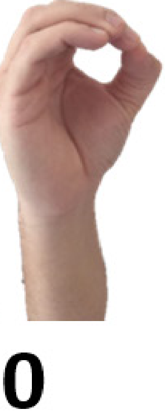
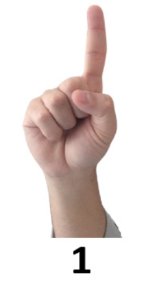
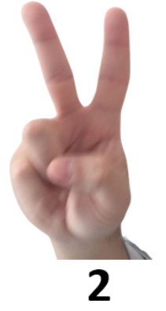
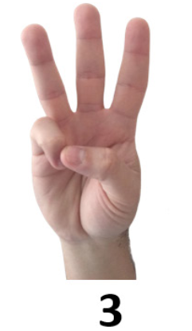
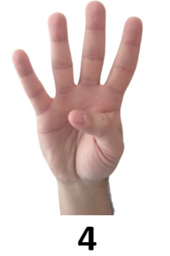
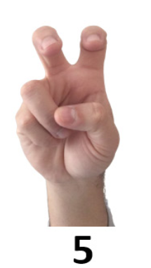
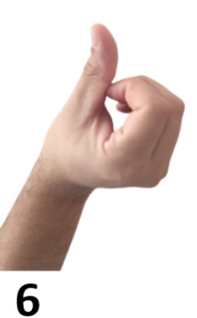
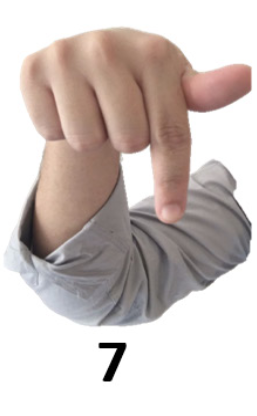
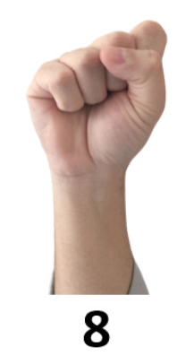
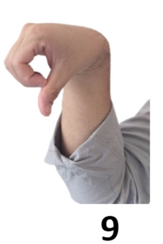

# Metodologia

## Surgimento da Ideia

Durante o estudo da disciplina de Libras, foi pesquisado sobre as metodologias de ensino de matemática para alunos surdos. Observou-se que grande parte do material didático existente é pensado exclusivamente para alunos ouvintes, apoiando-se fortemente na oralidade e em explicações verbais. Para o aluno surdo, cuja língua natural é a Língua Brasileira de Sinais (Libras), esse formato tradicional impõe barreiras significativas de acesso ao conteúdo matemático.

A partir dessa constatação, a professora da disciplina sugeriu a elaboração de um material didático voltado especificamente para o ensino de matemática para alunos surdos. Surgiu então a ideia de criar um jogo digital que integrasse a matemática com os sinais de Libras de forma lúdica e interativa. A proposta central era que o aluno resolvesse equações matemáticas simples utilizando sinais de Libras para responder, unindo o aprendizado dos números em Libras à prática de operações matemáticas fundamentais.

## Softwares Utilizados

O desenvolvimento do material utilizou exclusivamente ferramentas gratuitas e de código aberto:

- **Visual Studio Code** — editor de código para desenvolvimento
- **MediaPipe Hands (Google)** — biblioteca de visão computacional para detecção e rastreamento de mãos em tempo real, fornecendo 21 landmarks (pontos de referência) tridimensionais da mão
- **Git e GitHub** — controle de versão e hospedagem
- **GitHub Pages** — hospedagem gratuita do site estático
- **Docker e Nginx** — containerização e servidor web para execução local
- **Serve (npm)** — servidor HTTP simples para desenvolvimento local
- **Biome** — ferramenta de formatação e linting do código JavaScript

## Desenvolvimento do Material

O jogo foi desenvolvido como uma aplicação web front-end pura, sem necessidade de backend. A estrutura do projeto é composta por:

- `index.html` — estrutura da interface com o jogador
- `js/app.js` — orquestração principal: inicialização da câmera, carregamento do modelo de visão computacional, loop de processamento de vídeo
- `js/game.js` — lógica do jogo: sistema de níveis, pontuação, geração de equações
- `js/gesture-classifier.js` — classificador de gestos de Libras baseado nos landmarks do MediaPipe
- `models/hand_landmarker.task` — modelo treinado do MediaPipe (~7,5 MB)

O classificador de gestos foi implementado manualmente, sem redes neurais adicionais. Ele utiliza um sistema de coordenadas locais da mão (rotação-invariante) para determinar o estado de cada dedo (esticado, curvado ou meia-flexão) a partir dos landmarks 3D fornecidos pelo MediaPipe. As regras de correspondência foram mapeadas diretamente a partir da tabela visual dos sinais de Libras para os números de 0 a 9:

| Número | Descrição do Sinal |
|--------|-------------------|
| 0 | Mão em formato de "O" |
| 1 | Indicador esticado para cima |
| 2 | Indicador + Médio esticados (V) |
| 3 | Indicador + Médio + Anelar esticados |
| 4 | Quatro dedos esticados (polegar recolhido) |
| 5 | Indicador + Médio dobrados (orelhas de coelho) |
| 6 | Polegar estendido, mão apontando para cima/lado |
| 7 | Indicador + Polegar estendidos (L invertido) |
| 8 | Punho fechado |
| 9 | Polegar estendido, mão apontando para baixo |

Para garantir estabilidade, foi implementado um buffer de 10 quadros com um limiar de 60% de consistência antes de confirmar um dígito, além de um filtro One Euro Filter para suavizar o tremor natural da detecção dos landmarks.

## Como Funciona

O jogo apresenta equações matemáticas na tela. O jogador deve resolvê-las mentalmente e, em seguida, mostrar a resposta utilizando os sinais de Libras para a câmera do computador. O sistema reconhece o sinal em tempo real e valida a resposta.

Os sinais utilizados são os números de 0 a 9 em Libras. Para respostas com dois dígitos (acima de 9), o jogador faz os sinais um após o outro — primeiro o dígito das dezenas, depois o das unidades.

# Apresentação do Material

O **SignNum** é um jogo educativo que combina o aprendizado de matemática com o reconhecimento de sinais de Libras (Língua Brasileira de Sinais) utilizando visão computacional. O jogo é acessado via navegador web e utilizaa câmera do dispositivo para capturar os gestos feitos pelo jogador.

## Tela Inicial

Ao acessar o jogo, o jogador se depara com a tela inicial, que contém:

- O logo "SignNum" destacando o "Num" em verde
- A tagline "Matemática + Libras com visão computacional"
- Quatro passos ilustrados: apontar a câmera para a mão → resolver a equação → fazer o sinal da resposta → subir de nível
- Um botão "▶ COMEÇAR" (inicialmente desabilitado enquanto os modelos de visão computacional carregam)

Nesta tela, o navegador solicita permissão para acessar a câmera. O jogador deve permitir o acesso para que o jogo funcione.

## Interface do Jogo

Após clicar em "COMEÇAR", a interface principal é exibida. Ela é composta por:

**Barra Superior:**
- Logo do jogo à esquerda
- Indicadores de Nível, Pontuação (Pts) e Combo (sequência de acertos) à direita

**Linha do Desafio (três colunas):**

1. **Equação** (esquerda): exibe a operação matemática atual no formato de dados numerados. Por exemplo, "4 + 5 = ?". Os dados possuem uma animação de rotação ao trocar de pergunta. Abaixo, há um espaço para instruções — quando a resposta tem dois dígitos, aparece "Faça o sinal do 1º dígito..."

2. **Progresso** (centro): mostra 10 pontos (bolinhas) que são preenchidos a cada acerto. Quando todos os 10 pontos são preenchidos, o jogador sobe de nível.

3. **Resultado** (direita): exibe feedback sobre a última jogada ("Correto! +15 pts", "Erro! Resposta correta: 9", etc.)

**Área da Câmera:**
- O vídeo da webcam ocupa a maior parte da tela
- Sobreposto ao vídeo, há um esqueleto da mão (landmarks) desenhado em verde e amarelo
- Um painel de debug (opcional) exibe o estado de cada dedo (E = esticado, C = curvado, H = meia-flexão)
- No canto inferior esquerdo, há um indicador "Lendo" que exibe o número detectado em tempo real
- No canto superior direito, botões de pausa (⏸) e ajuda (?)
- Uma barra de tempo na parte inferior mostra o tempo restante para responder

## Como Jogar — Passo a Passo

### Passo 1: Equação é exibida

O jogo gera automaticamente uma equação matemática. Cada equação mostra dois números (em dados estilizados) e um operador (+ para adição, − para subtração, × para multiplicação). O jogador deve calcular mentalmente o resultado.

### Passo 2: Fazer o sinal de Libras

O jogador posiciona a mão aberta em frente à câmera e faz o sinal correspondente ao resultado da equação. O sistema detecta a mão e os landmarks são sobrepostos ao vídeo em tempo real.

À medida que o jogador muda a configuração dos dedos, o número detectado é atualizado no canto inferior esquerdo.

### Passo 3: Resposta é processada

Quando o jogador mantém um sinal estável por tempo suficiente, o sistema o reconhece como resposta. Se a resposta estiver correta:

- Uma borda verde pisca ao redor da câmera
- Um popup flutuante "+N pts" aparece na tela
- A pontuação aumenta e o combo é incrementado
- O feedback "Correto! +N pts" é exibido
- A próxima equação é carregada automaticamente

### Passo 4: Sequência de acertos

A cada acerto consecutivo, o combo aumenta. Quando o jogador atinge 3 acertos seguidos, o combo fica em destaque (dourado). Ao atingir 5 acertos seguidos, o combo fica vermelho com brilho.

### Passo 5: Subida de nível

Ao completar 10 acertos consecutivos, o jogador sobe de nível. Há três níveis disponíveis:

- **Iniciação** (Nível 1): soma de números de 1 a 6, respostas de 2 a 9
- **Consolidação** (Nível 2): adição e subtração, respostas de 0 a 9, limite de 10 segundos por questão
- **Domínio** (Nível 3): multiplicação de 2 a 6, respostas de 1 a 36, limite de 12 segundos por questão

### Passo 6: Resposta com dois dígitos

Para respostas acima de 9, como "12", o jogador deve sinalizar primeiro o dígito das dezenas (1) e depois o dígito das unidades (2). Uma mensagem na tela orienta: "Dígito 1: X — agora o 2º..."

### Passo 7: Erro ou tempo esgotado

Se o jogador errar ou o tempo acabar, o combo é zerado (perdendo a progressão de nível), a resposta correta é exibida e uma nova pergunta é carregada após um breve intervalo.

### Pausa e Ajuda

O jogador pode pausar o jogo a qualquer momento clicando no botão ⏸. A tela de pausa permite retomar o jogo. O botão "?" abre um modal com a referência visual de todos os sinais de Libras (0 a 9) para consulta rápida.

## Níveis do Jogo

| Nível | Nome | Operação | Intervalo | Tempo |
|-------|------|----------|-----------|-------|
| 1 | Iniciação | Adição | 1 a 6 → 2 a 9 | 10s |
| 2 | Consolidação | Adição/Subtração | 1 a 9 → 0 a 9 | 10s |
| 3 | Domínio | Multiplicação | 2 a 6 → 1 a 36 | 12s |

## Sistema de Pontuação

A pontuação é calculada com base em:
- **Base**: nível × 10 pontos por acerto
- **Bônus de velocidade**: responder em menos de 7s dá +1, menos de 5s dá +3, menos de 3s dá +5
- **Multiplicador de combo**: a cada 5 acertos consecutivos, o multiplicador aumenta em 0.5×
